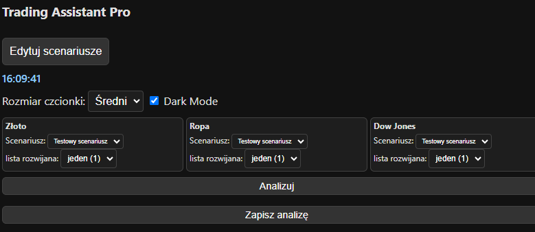

# Trading Assistant Pro 📈

A simple yet powerful Chrome extension that helps you analyze trading scenarios across multiple markets (Gold, Oil, and Dow Jones) in real-time.

## What does it do?

Ever found yourself juggling multiple trading scenarios in your head? This extension helps you:
- Track market conditions for Gold, Oil, and Dow Jones simultaneously
- Create and manage custom trading scenarios
- Get instant feedback on market conditions
- Save your analysis for later reference

## How to use it?

1. Click the extension icon in Chrome
2. Select your market (Gold/Oil/Dow Jones)
3. Set the current market conditions
4. Get instant analysis based on your predefined scenarios
5. Save your analysis for later

## Installation

1. Download the extension
2. Open Chrome and go to `chrome://extensions/`
3. Enable "Developer mode" (top right)
4. Click "Load unpacked" and select the extension folder
5. You're ready to go

## License

MIT - do whatever you want with it! 

---

*Built with ❤️ for traders by traders*
